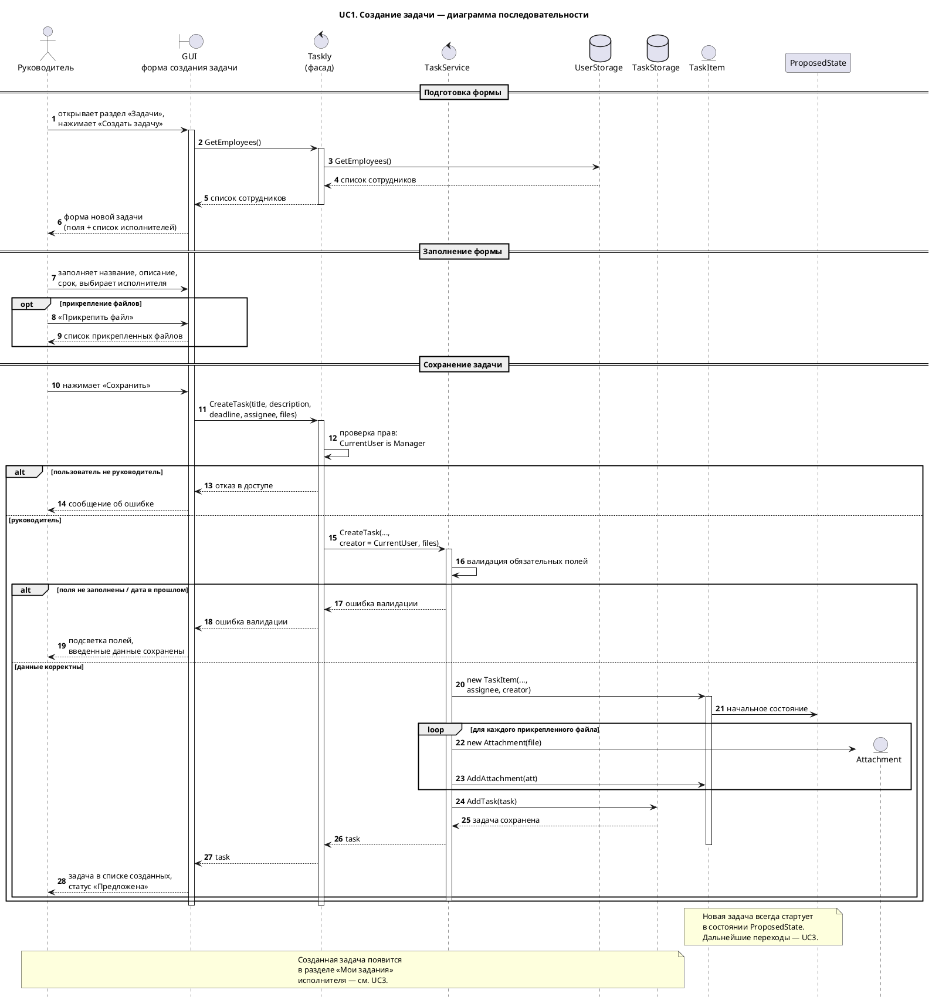

```plantuml
@startuml
title UC1. Создание задачи — диаграмма последовательности
autonumber
hide footbox

actor Руководитель as Manager
boundary "GUI\nформа создания задачи" as GUI
control "Taskly\n(фасад)" as Taskly
control TaskService as Service
database UserStorage as Users
database TaskStorage as Storage
entity TaskItem as Task
participant ProposedState as Proposed

== Подготовка формы ==
Manager -> GUI : открывает раздел «Задачи»,\nнажимает «Создать задачу»
activate GUI
GUI -> Taskly : GetEmployees()
activate Taskly
Taskly -> Users : GetEmployees()
Users --> Taskly : список сотрудников
Taskly --> GUI : список сотрудников
deactivate Taskly
GUI --> Manager : форма новой задачи\n(поля + список исполнителей)

== Заполнение формы ==
Manager -> GUI : заполняет название, описание,\nсрок, выбирает исполнителя

opt прикрепление файлов
    Manager -> GUI : «Прикрепить файл»
    GUI --> Manager : список прикрепленных файлов
end

== Сохранение задачи ==
Manager -> GUI : нажимает «Сохранить»
GUI -> Taskly : CreateTask(title, description,\ndeadline, assignee, files)
activate Taskly
Taskly -> Taskly : проверка прав:\nCurrentUser is Manager

alt пользователь не руководитель
    Taskly --> GUI : отказ в доступе
    GUI --> Manager : сообщение об ошибке
else руководитель
    Taskly -> Service : CreateTask(...,\ncreator = CurrentUser, files)
    activate Service
    Service -> Service : валидация обязательных полей
    alt поля не заполнены / дата в прошлом
        Service --> Taskly : ошибка валидации
        Taskly --> GUI : ошибка валидации
        GUI --> Manager : подсветка полей,\nвведенные данные сохранены
    else данные корректны
        Service -> Task : new TaskItem(...,\nassignee, creator)
        activate Task
        Task -> Proposed : начальное состояние
        loop для каждого прикрепленного файла
            create entity Attachment as Att
            Service -> Att : new Attachment(file)
            Service -> Task : AddAttachment(att)
        end
        Service -> Storage : AddTask(task)
        Storage --> Service : задача сохранена
        Service --> Taskly : task
        deactivate Task
        Taskly --> GUI : task
        GUI --> Manager : задача в списке созданных,\nстатус «Предложена»
    end
    deactivate Service
end
deactivate Taskly
deactivate GUI

note over Task, Proposed
  Новая задача всегда стартует
  в состоянии ProposedState.
  Дальнейшие переходы — UC3.
end note

note over Manager, Storage
  Созданная задача появится
  в разделе «Мои задания»
  исполнителя — см. UC3.
end note

@enduml
```
