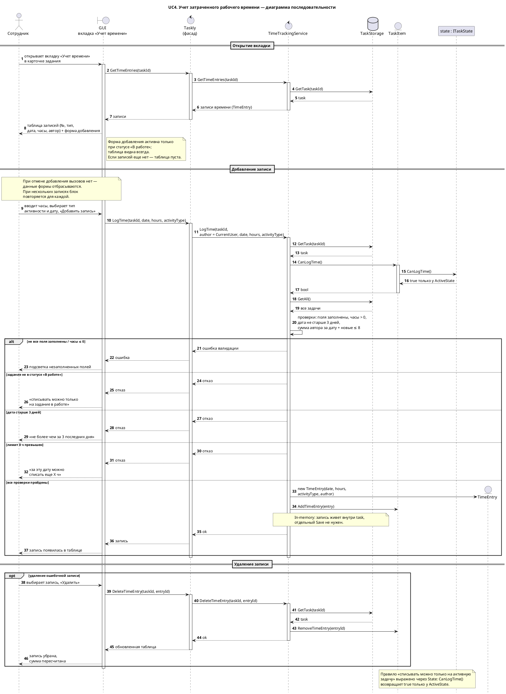

```plantuml
@startuml
title UC4. Учет затраченного рабочего времени — диаграмма последовательности
autonumber
hide footbox

actor Сотрудник as Emp
boundary "GUI\nвкладка «Учет времени»" as GUI
control "Taskly\n(фасад)" as Taskly
control TimeTrackingService as Service
database TaskStorage as Storage
entity TaskItem as Task
participant "state : ITaskState" as State

== Открытие вкладки ==
Emp -> GUI : открывает вкладку «Учет времени»\nв карточке задания
activate GUI
GUI -> Taskly : GetTimeEntries(taskId)
activate Taskly
Taskly -> Service : GetTimeEntries(taskId)
activate Service
Service -> Storage : GetTask(taskId)
Storage --> Service : task
Service --> Taskly : записи времени (TimeEntry)
deactivate Service
Taskly --> GUI : записи
deactivate Taskly
GUI --> Emp : таблица записей (№, тип,\nдата, часы, автор) + форма добавления
note right of GUI
  Форма добавления активна только
  при статусе «В работе»;
  таблица видна всегда.
  Если записей еще нет — таблица пуста.
end note

== Добавление записи ==
note over Emp, GUI
  При отмене добавления вызовов нет —
  данные формы отбрасываются.
  При нескольких записях блок
  повторяется для каждой.
end note
Emp -> GUI : вводит часы, выбирает тип\nактивности и дату, «Добавить запись»
GUI -> Taskly : LogTime(taskId, date, hours, activityType)
activate Taskly
Taskly -> Service : LogTime(taskId,\nauthor = CurrentUser, date, hours, activityType)
activate Service
Service -> Storage : GetTask(taskId)
Storage --> Service : task
Service -> Task : CanLogTime()
activate Task
Task -> State : CanLogTime()
State --> Task : true только у ActiveState
Task --> Service : bool
deactivate Task
Service -> Storage : GetAll()
Storage --> Service : все задачи
Service -> Service : проверки: поля заполнены, часы > 0,\nдата не старше 3 дней,\nсумма автора за дату + новые ≤ 8

alt не все поля заполнены / часы ≤ 0
    Service --> Taskly : ошибка валидации
    Taskly --> GUI : ошибка
    GUI --> Emp : подсветка незаполненных полей
else задание не в статусе «В работе»
    Service --> Taskly : отказ
    Taskly --> GUI : отказ
    GUI --> Emp : «списывать можно только\nна задание в работе»
else дата старше 3 дней
    Service --> Taskly : отказ
    Taskly --> GUI : отказ
    GUI --> Emp : «не более чем за 3 последних дня»
else лимит 8 ч превышен
    Service --> Taskly : отказ
    Taskly --> GUI : отказ
    GUI --> Emp : «за эту дату можно\nсписать еще X ч»
else все проверки пройдены
    create entity TimeEntry as Entry
    Service -> Entry : new TimeEntry(date, hours,\nactivityType, author)
    Service -> Task : AddTimeEntry(entry)
    note over Service, Storage
      In-memory: запись живет внутри task,
      отдельный Save не нужен.
    end note
    Service --> Taskly : ok
    Taskly --> GUI : запись
    GUI --> Emp : запись появилась в таблице
end
deactivate Service
deactivate Taskly

== Удаление записи ==
opt удаление ошибочной записи
    Emp -> GUI : выбирает запись, «Удалить»
    GUI -> Taskly : DeleteTimeEntry(taskId, entryId)
    activate Taskly
    Taskly -> Service : DeleteTimeEntry(taskId, entryId)
    activate Service
    Service -> Storage : GetTask(taskId)
    Storage --> Service : task
    Service -> Task : RemoveTimeEntry(entryId)
    Service --> Taskly : ok
    deactivate Service
    Taskly --> GUI : обновленная таблица
    deactivate Taskly
    GUI --> Emp : запись убрана,\nсумма пересчитана
end
deactivate GUI

note over Task, State
  Правило «списывать можно только на активную
  задачу» выражено через State: CanLogTime()
  возвращает true только у ActiveState.
end note

@enduml

```
