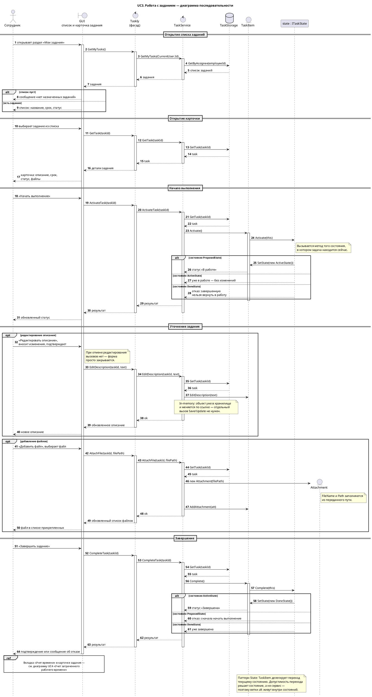

```plantuml
@startuml
title UC3. Работа с заданием — диаграмма последовательности
autonumber
hide footbox

actor Сотрудник as Emp
boundary "GUI\nсписок и карточка задания" as GUI
control "Taskly\n(фасад)" as Taskly
control TaskService as Service
database TaskStorage as Storage
entity TaskItem as Task
participant "state : ITaskState" as State

== Открытие списка заданий ==
Emp -> GUI : открывает раздел «Мои задания»
activate GUI
GUI -> Taskly : GetMyTasks()
activate Taskly
Taskly -> Service : GetMyTasks(CurrentUser.Id)
activate Service
Service -> Storage : GetByAssignee(employeeId)
Storage --> Service : список заданий
Service --> Taskly : задания
deactivate Service
Taskly --> GUI : задания
deactivate Taskly

alt список пуст
    GUI --> Emp : сообщение «нет назначенных заданий»
else есть задания
    GUI --> Emp : список: название, срок, статус
end

== Открытие карточки ==
Emp -> GUI : выбирает задание из списка
GUI -> Taskly : GetTask(taskId)
activate Taskly
Taskly -> Service : GetTask(taskId)
activate Service
Service -> Storage : GetTask(taskId)
Storage --> Service : task
Service --> Taskly : task
deactivate Service
Taskly --> GUI : детали задания
deactivate Taskly
GUI --> Emp : карточка: описание, срок,\nстатус, файлы

== Начало выполнения ==
Emp -> GUI : «Начать выполнение»
GUI -> Taskly : ActivateTask(taskId)
activate Taskly
Taskly -> Service : ActivateTask(taskId)
activate Service
Service -> Storage : GetTask(taskId)
Storage --> Service : task
Service -> Task : Activate()
activate Task
Task -> State : Activate(this)
note right of State
  Вызывается метод того состояния,
  в котором задача находится сейчас.
end note
alt состояние ProposedState
    State -> Task : SetState(new ActiveState())
    Task --> Service : статус «В работе»
else состояние ActiveState
    State --> Service : уже в работе — без изменений
else состояние DoneState
    State --> Service : отказ: завершенную\nнельзя вернуть в работу
end
deactivate Task
Service --> Taskly : результат
Taskly --> GUI : результат
deactivate Service
deactivate Taskly
GUI --> Emp : обновленный статус

== Уточнение задания ==
opt редактирование описания
    Emp -> GUI : «Редактировать описание»,\nвносит изменения, подтверждает
    note right of GUI
      При отмене редактирования
      вызовов нет — форма
      просто закрывается.
    end note
    GUI -> Taskly : EditDescription(taskId, text)
    activate Taskly
    Taskly -> Service : EditDescription(taskId, text)
    activate Service
    Service -> Storage : GetTask(taskId)
    Storage --> Service : task
    Service -> Task : EditDescription(text)
    note over Service, Storage
      In-memory: объект уже в хранилище
      и меняется по ссылке — отдельный
      вызов Save/Update не нужен.
    end note
    Service --> Taskly : ok
    deactivate Service
    Taskly --> GUI : обновленное описание
    deactivate Taskly
    GUI --> Emp : новое описание
end

opt добавление файлов
    Emp -> GUI : «Добавить файл», выбирает файл
    GUI -> Taskly : AttachFile(taskId, filePath)
    activate Taskly
    Taskly -> Service : AttachFile(taskId, filePath)
    activate Service
    Service -> Storage : GetTask(taskId)
    Storage --> Service : task
    create entity Attachment as Att
    Service -> Att : new Attachment(filePath)
    note right of Att
      FileName и Path заполняются
      из переданного пути.
    end note
    Service -> Task : AddAttachment(att)
    Service --> Taskly : ok
    deactivate Service
    Taskly --> GUI : обновленный список файлов
    deactivate Taskly
    GUI --> Emp : файл в списке прикрепленных
end

== Завершение ==
Emp -> GUI : «Завершить задание»
GUI -> Taskly : CompleteTask(taskId)
activate Taskly
Taskly -> Service : CompleteTask(taskId)
activate Service
Service -> Storage : GetTask(taskId)
Storage --> Service : task
Service -> Task : Complete()
activate Task
Task -> State : Complete(this)
alt состояние ActiveState
    State -> Task : SetState(new DoneState())
    Task --> Service : статус «Завершена»
else состояние ProposedState
    State --> Service : отказ: сначала начать выполнение
else состояние DoneState
    State --> Service : уже завершена
end
deactivate Task
Service --> Taskly : результат
Taskly --> GUI : результат
deactivate Service
deactivate Taskly
GUI --> Emp : подтверждение или сообщение об отказе
deactivate GUI

ref over Emp, GUI
  Вкладка «Учет времени» в карточке задания —
  см. диаграмму UC4 «Учет затраченного
  рабочего времени»
end ref

note over Task, State
  Паттерн State: TaskItem делегирует переход
  текущему состоянию. Допустимость перехода
  решает состояние, а не сервис —
  поэтому ветки alt живут внутри состояний.
end note

@enduml
```
