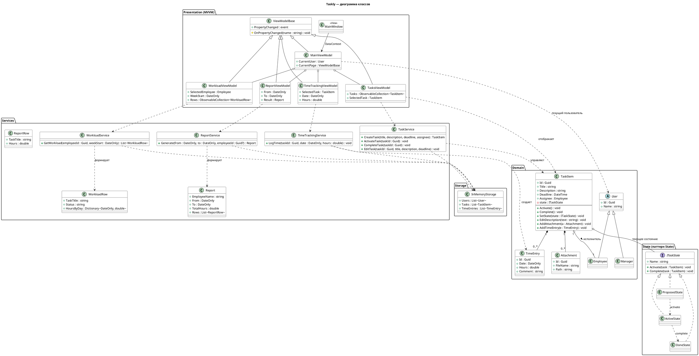

```plantuml
@startuml
title Taskly — диаграмма классов

skinparam class {
  BackgroundColor https://www.planttext.com/images/icons8-export-24.svg?v=24.21White
  BorderColor Black
}

package "Domain" {

  abstract class User {
    +Id : Guid
    +Name : string
  }
  class Manager
  class Employee

  class TaskItem {
    +Id : Guid
    +Title : string
    +Description : string
    +Deadline : DateTime
    +Assignee : Employee
    -state : ITaskState
    --
    +Activate() : void
    +Complete() : void
    +SetState(state : ITaskState) : void
    +EditDescription(text : string) : void
    +AddAttachment(a : Attachment) : void
    +AddTimeEntry(e : TimeEntry) : void
  }

  class Attachment {
    +Id : Guid
    +FileName : string
    +Path : string
  }

  class TimeEntry {
    +Id : Guid
    +Date : DateOnly
    +Hours : double
    +Comment : string
  }

  User <|-- Manager
  User <|-- Employee
  TaskItem "1" o-- "1" Employee : исполнитель >
  TaskItem "1" *-- "0..*" Attachment
  TaskItem "1" *-- "0..*" TimeEntry
}

package "State (паттерн State)" {

  interface ITaskState {
    +Name : string
    +Activate(task : TaskItem) : void
    +Complete(task : TaskItem) : void
  }

  class ProposedState
  class ActiveState
  class DoneState

  ITaskState <|.. ProposedState
  ITaskState <|.. ActiveState
  ITaskState <|.. DoneState

  ProposedState ..> ActiveState : activate
  ActiveState ..> DoneState : complete
}

TaskItem o-- ITaskState : текущее состояние

package "Services" {

  class TaskService {
    +CreateTask(title, description, deadline, assignee) : TaskItem
    +ActivateTask(taskId : Guid) : void
    +CompleteTask(taskId : Guid) : void
    +EditTask(taskId : Guid, title, description, deadline) : void
  }

  class TimeTrackingService {
    +LogTime(taskId : Guid, date : DateOnly, hours : double) : void
  }

  class WorkloadService {
    +GetWorkload(employeeId : Guid, weekStart : DateOnly) : List~WorkloadRow~
  }

  class ReportService {
    +Generate(from : DateOnly, to : DateOnly, employeeId : Guid?) : Report
  }

  class WorkloadRow {
    +TaskTitle : string
    +Status : string
    +HoursByDay : Dictionary~DateOnly, double~
  }

  class Report {
    +EmployeeName : string
    +From : DateOnly
    +To : DateOnly
    +TotalHours : double
    +Rows : List~ReportRow~
  }

  class ReportRow {
    +TaskTitle : string
    +Hours : double
  }
}

package "Storage" {

  class InMemoryStorage {
    +Users : List~User~
    +Tasks : List~TaskItem~
    +TimeEntries : List~TimeEntry~
  }
}

package "Presentation (MVVM)" {

  class MainWindow <<View>>

  class ViewModelBase {
    +PropertyChanged : event
    #OnPropertyChanged(name : string) : void
  }

  class MainViewModel {
    +CurrentUser : User
    +CurrentPage : ViewModelBase
  }

  class TasksViewModel {
    +Tasks : ObservableCollection~TaskItem~
    +SelectedTask : TaskItem
  }

  class TimeTrackingViewModel {
    +SelectedTask : TaskItem
    +Date : DateOnly
    +Hours : double
  }

  class WorkloadViewModel {
    +SelectedEmployee : Employee
    +WeekStart : DateOnly
    +Rows : ObservableCollection~WorkloadRow~
  }

  class ReportViewModel {
    +From : DateOnly
    +To : DateOnly
    +Result : Report
  }

  ViewModelBase <|-- MainViewModel
  ViewModelBase <|-- TasksViewModel
  ViewModelBase <|-- TimeTrackingViewModel
  ViewModelBase <|-- WorkloadViewModel
  ViewModelBase <|-- ReportViewModel

  MainWindow --> MainViewModel : DataContext
  MainViewModel o-- TasksViewModel
  MainViewModel o-- TimeTrackingViewModel
  MainViewModel o-- WorkloadViewModel
  MainViewModel o-- ReportViewModel

  TasksViewModel ..> TaskService
  TimeTrackingViewModel ..> TimeTrackingService
  WorkloadViewModel ..> WorkloadService
  ReportViewModel ..> ReportService
}

TasksViewModel ..> TaskItem : отображает
MainViewModel ..> User : текущий пользователь

TaskService ..> InMemoryStorage
TimeTrackingService ..> InMemoryStorage
WorkloadService ..> InMemoryStorage
ReportService ..> InMemoryStorage

TaskService ..> TaskItem : управляет
TimeTrackingService ..> TimeEntry : создает
WorkloadService ..> WorkloadRow : формирует
ReportService ..> Report : формирует


@enduml
```
