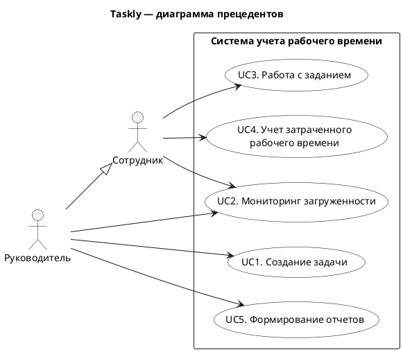

```plantuml
@startuml
title Taskly — диаграмма прецедентов

left to right direction
skinparam usecase {
  BackgroundColor White
  BorderColor Black
}

actor Руководитель
actor Сотрудник

Руководитель --|> Сотрудник

rectangle "Система учета рабочего времени" {

  usecase "UC1. Создание задачи" as UC1
  usecase "UC2. Мониторинг загруженности" as UC2
  usecase "UC3. Работа с заданием" as UC3
  usecase "UC4. Учет затраченного\nрабочего времени" as UC4
  usecase "UC5. Формирование отчетов" as UC5

}

Руководитель --> UC1
Руководитель --> UC2
Руководитель --> UC5
Сотрудник --> UC3
Сотрудник --> UC4
Сотрудник --> UC2


@endum2
```
