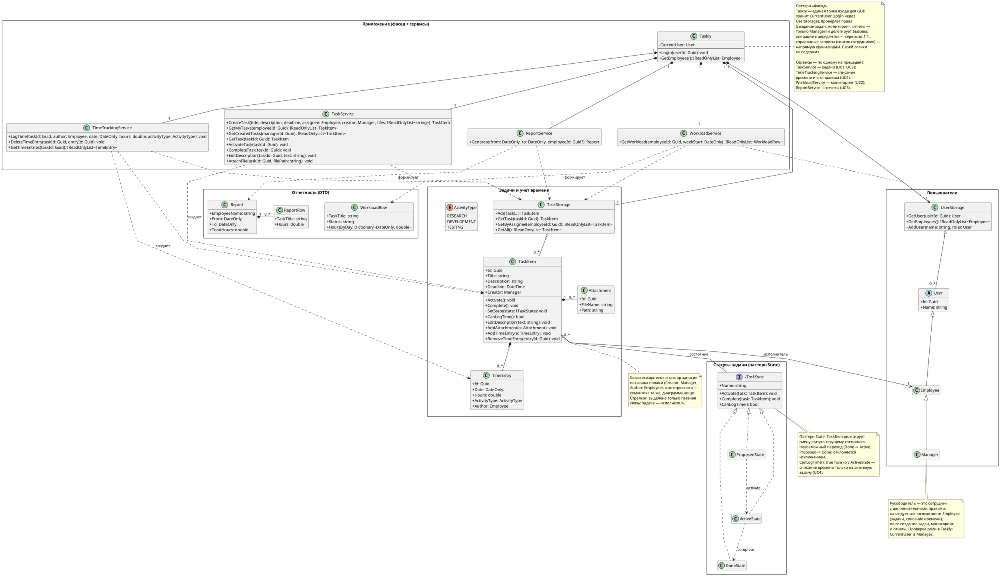

```plantuml
@startuml classes-taskly-simple
allowmixing
skinparam classAttributeIconSize 0
skinparam linetype polyline
skinparam nodesep 55
hide empty members

rectangle "Приложение (фасад + сервисы)" as AppPart {

  class Taskly {
    - CurrentUser: User
    --
    + Login(userId: Guid): void
    + GetEmployees(): IReadOnlyList~Employee~
  }

  class TaskService {
    + CreateTask(title, description, deadline, assignee: Employee, creator: Manager, files: IReadOnlyList~string~): TaskItem
    + GetMyTasks(employeeId: Guid): IReadOnlyList~TaskItem~
    + GetCreatedTasks(managerId: Guid): IReadOnlyList~TaskItem~
    + GetTask(taskId: Guid): TaskItem
    + ActivateTask(taskId: Guid): void
    + CompleteTask(taskId: Guid): void
    + EditDescription(taskId: Guid, text: string): void
    + AttachFile(taskId: Guid, filePath: string): void
  }

  class TimeTrackingService {
    + LogTime(taskId: Guid, author: Employee, date: DateOnly, hours: double, activityType: ActivityType): void
    + DeleteTimeEntry(taskId: Guid, entryId: Guid): void
    + GetTimeEntries(taskId: Guid): IReadOnlyList~TimeEntry~
  }

  class WorkloadService {
    + GetWorkload(employeeId: Guid, weekStart: DateOnly): IReadOnlyList~WorkloadRow~
  }

  class ReportService {
    + Generate(from: DateOnly, to: DateOnly, employeeId: Guid?): Report
  }
}

rectangle "Задачи и учет времени" as TasksPart {

  class TaskItem {
    + Id: Guid
    + Title: string
    + Description: string
    + Deadline: DateTime
    + Creator: Manager
    --
    + Activate(): void
    + Complete(): void
    ~ SetState(state: ITaskState): void
    + CanLogTime(): bool
    + EditDescription(text: string): void
    + AddAttachment(a: Attachment): void
    + AddTimeEntry(e: TimeEntry): void
    + RemoveTimeEntry(entryId: Guid): void
  }

  class TimeEntry {
    + Id: Guid
    + Date: DateOnly
    + Hours: double
    + ActivityType: ActivityType
    + Author: Employee
  }

  enum ActivityType {
    RESEARCH
    DEVELOPMENT
    TESTING
  }

  class Attachment {
    + Id: Guid
    + FileName: string
    + Path: string
  }

  class TaskStorage {
    ~ AddTask(...): TaskItem
    + GetTask(taskId: Guid): TaskItem
    + GetByAssignee(employeeId: Guid): IReadOnlyList~TaskItem~
    + GetAll(): IReadOnlyList~TaskItem~
  }
}

rectangle "Пользователи" as UsersPart {

  abstract class User {
    + Id: Guid
    + Name: string
  }

  class Manager
  class Employee

  class UserStorage {
    + GetUser(userId: Guid): User
    + GetEmployees(): IReadOnlyList~Employee~
    ~ AddUser(name: string, role): User
  }
}

rectangle "Статусы задачи (паттерн State)" as StatePart {

  interface ITaskState {
    + Name: string
    + Activate(task: TaskItem): void
    + Complete(task: TaskItem): void
    + CanLogTime(): bool
  }

  class ProposedState
  class ActiveState
  class DoneState
}

rectangle "Отчетность (DTO)" as ReportsPart {

  class WorkloadRow {
    + TaskTitle: string
    + Status: string
    + HoursByDay: Dictionary~DateOnly, double~
  }

  class Report {
    + EmployeeName: string
    + From: DateOnly
    + To: DateOnly
    + TotalHours: double
  }

  class ReportRow {
    + TaskTitle: string
    + Hours: double
  }
}

Taskly "1" *-down- "1" TaskService
Taskly "1" *-down- "1" TimeTrackingService
Taskly "1" *-down- "1" WorkloadService
Taskly "1" *-down- "1" ReportService
Taskly "1" *-right- "1" TaskStorage
Taskly "1" *-down- "1" UserStorage

TaskService ..> TaskStorage
TimeTrackingService ..> TaskStorage
WorkloadService ..> TaskStorage
ReportService ..> TaskStorage
WorkloadService ..> UserStorage

TaskService ..> TaskItem : создает
TimeTrackingService ..> TaskItem
TimeTrackingService ..> TimeEntry : создает

User <|-- Employee
Employee <|-- Manager

note bottom of Manager
  Руководитель — это сотрудник
  с дополнительными правами:
  наследует все возможности Employee
  (задачи, списание времени),
  плюс создание задач, мониторинг
  и отчеты. Проверка роли в Taskly:
  CurrentUser is Manager.
end note
UserStorage "1" o-down- "0..*" User

TaskStorage "1" o-down- "0..*" TaskItem
TaskItem "1" *-down- "0..*" TimeEntry
TaskItem "1" *-right- "0..*" Attachment
TaskItem "0..*" -right-> "1" Employee : исполнитель

TaskItem "1" o-down- "1" ITaskState : состояние
ITaskState <|.. ProposedState
ITaskState <|.. ActiveState
ITaskState <|.. DoneState
ProposedState ..> ActiveState : activate
ActiveState ..> DoneState : complete

Report "1" *-right- "0..*" ReportRow
WorkloadService ..> WorkloadRow : формирует
ReportService ..> Report : формирует

note right of Taskly
  Паттерн «Фасад».
  Taskly — единая точка входа для GUI:
  хранит CurrentUser (Login через
  UserStorage), проверяет права
  (создание задач, мониторинг, отчеты —
  только Manager) и делегирует вызовы:
  операции прецедентов — сервисам 1:1,
  справочные запросы (список сотрудников) —
  напрямую хранилищам. Своей логики
  не содержит.

  Сервисы — по одному на прецедент:
  TaskService — задачи (UC1, UC3);
  TimeTrackingService — списание
  времени и его правила (UC4);
  WorkloadService — мониторинг (UC2);
  ReportService — отчеты (UC5).
end note

note bottom of TaskItem
  Связи «создатель» и «автор записи»
  показаны полями (Creator: Manager,
  Author: Employee), а не стрелками —
  семантика та же, диаграмма чище.
  Стрелкой выделена только главная
  связь: задача — исполнитель.
end note

note bottom of ITaskState
  Паттерн State: TaskItem делегирует
  смену статуса текущему состоянию.
  Невозможный переход (Done -> Active,
  Proposed -> Done) отклоняется
  исключением.
  CanLogTime(): true только у ActiveState —
  списание времени только на активную
  задачу (UC4).
end note

TimeTrackingService -[hidden]right- TaskService
TaskService -[hidden]right- WorkloadService
WorkloadService -[hidden]right- ReportService

TasksPart -[hidden]right- UsersPart

@enduml
```
