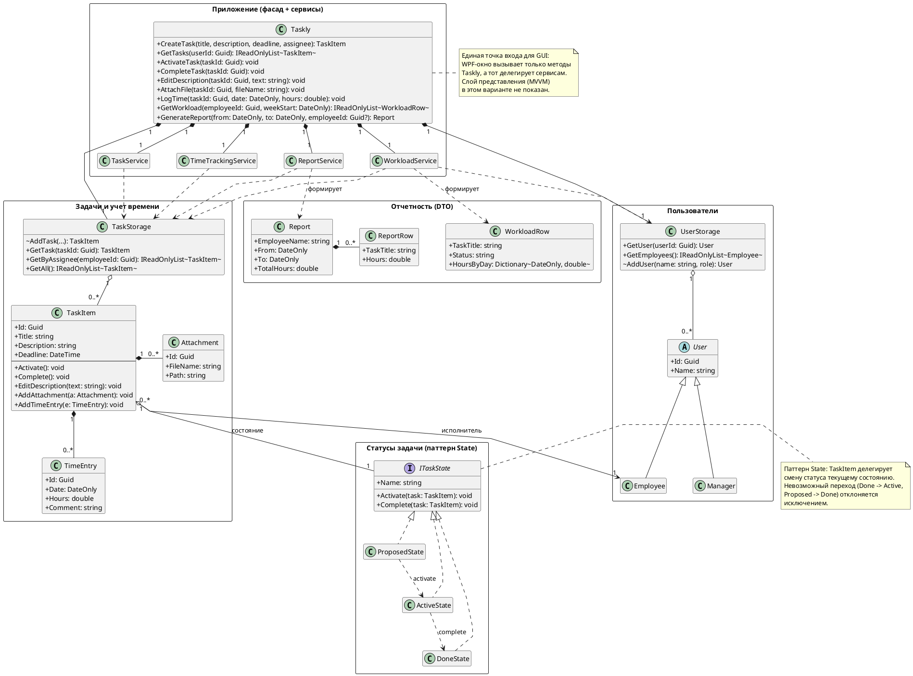

```plantuml
@startuml classes-taskly-simple
allowmixing
skinparam classAttributeIconSize 0
skinparam linetype polyline
skinparam nodesep 55
hide empty members

rectangle "Приложение (фасад + сервисы)" as AppPart {

  class Taskly {
    + CreateTask(title, description, deadline, assignee): TaskItem
    + GetTasks(userId: Guid): IReadOnlyList~TaskItem~
    + ActivateTask(taskId: Guid): void
    + CompleteTask(taskId: Guid): void
    + EditDescription(taskId: Guid, text: string): void
    + AttachFile(taskId: Guid, fileName: string): void
    + LogTime(taskId: Guid, date: DateOnly, hours: double): void
    + GetWorkload(employeeId: Guid, weekStart: DateOnly): IReadOnlyList~WorkloadRow~
    + GenerateReport(from: DateOnly, to: DateOnly, employeeId: Guid?): Report
  }

  class TaskService
  class TimeTrackingService
  class WorkloadService
  class ReportService
}

rectangle "Пользователи" as UsersPart {

  abstract class User {
    + Id: Guid
    + Name: string
  }

  class Manager
  class Employee

  class UserStorage {
    + GetUser(userId: Guid): User
    + GetEmployees(): IReadOnlyList~Employee~
    ~ AddUser(name: string, role): User
  }
}

rectangle "Задачи и учет времени" as TasksPart {

  class TaskItem {
    + Id: Guid
    + Title: string
    + Description: string
    + Deadline: DateTime
    --
    + Activate(): void
    + Complete(): void
    + EditDescription(text: string): void
    + AddAttachment(a: Attachment): void
    + AddTimeEntry(e: TimeEntry): void
  }

  class TimeEntry {
    + Id: Guid
    + Date: DateOnly
    + Hours: double
    + Comment: string
  }

  class Attachment {
    + Id: Guid
    + FileName: string
    + Path: string
  }

  class TaskStorage {
    ~ AddTask(...): TaskItem
    + GetTask(taskId: Guid): TaskItem
    + GetByAssignee(employeeId: Guid): IReadOnlyList~TaskItem~
    + GetAll(): IReadOnlyList~TaskItem~
  }
}

rectangle "Статусы задачи (паттерн State)" as StatePart {

  interface ITaskState {
    + Name: string
    + Activate(task: TaskItem): void
    + Complete(task: TaskItem): void
  }

  class ProposedState
  class ActiveState
  class DoneState
}

rectangle "Отчетность (DTO)" as ReportsPart {

  class WorkloadRow {
    + TaskTitle: string
    + Status: string
    + HoursByDay: Dictionary~DateOnly, double~
  }

  class Report {
    + EmployeeName: string
    + From: DateOnly
    + To: DateOnly
    + TotalHours: double
  }

  class ReportRow {
    + TaskTitle: string
    + Hours: double
  }
}

Taskly "1" *-down- "1" TaskService
Taskly "1" *-down- "1" TimeTrackingService
Taskly "1" *-down- "1" WorkloadService
Taskly "1" *-down- "1" ReportService
Taskly "1" *-right- "1" TaskStorage
Taskly "1" *-down- "1" UserStorage

TaskService ..> TaskStorage
TimeTrackingService ..> TaskStorage
WorkloadService ..> TaskStorage
ReportService ..> TaskStorage
WorkloadService ..> UserStorage

User <|-- Manager
User <|-- Employee
UserStorage "1" o-down- "0..*" User

TaskStorage "1" o-down- "0..*" TaskItem
TaskItem "1" *-down- "0..*" TimeEntry
TaskItem "1" *-right- "0..*" Attachment
TaskItem "0..*" -right-> "1" Employee : исполнитель

TaskItem "1" o-down- "1" ITaskState : состояние
ITaskState <|.. ProposedState
ITaskState <|.. ActiveState
ITaskState <|.. DoneState
ProposedState ..> ActiveState : activate
ActiveState ..> DoneState : complete

Report "1" *-right- "0..*" ReportRow
WorkloadService ..> WorkloadRow : формирует
ReportService ..> Report : формирует

note right of Taskly
  Единая точка входа для GUI:
  WPF-окно вызывает только методы
  Taskly, а тот делегирует сервисам.
  Слой представления (MVVM)
  в этом варианте не показан.
end note

note right of ITaskState
  Паттерн State: TaskItem делегирует
  смену статуса текущему состоянию.
  Невозможный переход (Done -> Active,
  Proposed -> Done) отклоняется
  исключением.
end note

TaskService -[hidden]right- TimeTrackingService
TimeTrackingService -[hidden]right- WorkloadService
WorkloadService -[hidden]right- ReportService

@enduml
```
